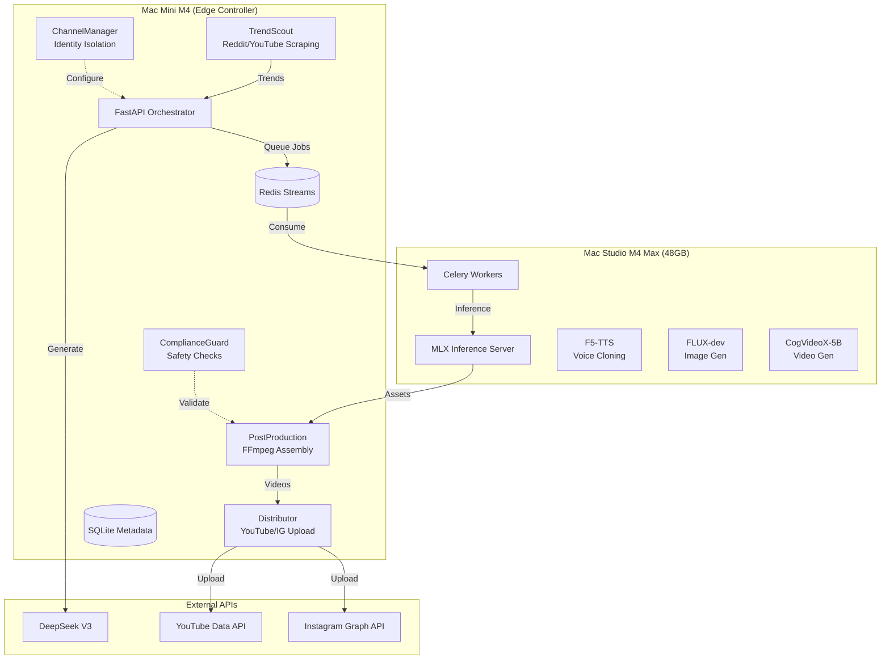

# Monolathe 🤖🎬

> Production-grade AI content automation pipeline leveraging Hong Kong infrastructure for cost-effective, multi-tenant video production at scale.

Monolathe sounds like monolith, which refers to the software design approach where an application is built as a single, unified unit, integrating the user interface, business logic, and data access into one codebase. Additionally, a mono lathe (specifically a mono-only cutting head lathe) is a specialized machine used to cut records in real-time by engraving audio onto a disc using a single channel. These machines, often utilizing vintage equipment, produce mono vinyl records—often for limited, independent, or lathe-cut releases—by pressing the material into the disc rather than using stereo, multi-channel cutting.

This branding is perfectly on par with the ideology behind this system.

[](https://www.python.org/downloads/)
[](https://fastapi.tiangolo.com/)
[](https://opensource.org/licenses/MIT)

## 🎯 Mission

Monolathe arbitrages Chinese AI costs (DeepSeek API, local MLX inference) against Western platform revenue (YouTube/Instagram), targeting:

- **50+ videos/day** across **12+ channels**
- **Zero API costs** for inference (local MLX models)
- **< $0.10 USD** cost per video (electricity + API only)
- **100% automated** pipeline with anti-detection compliance

## 🏗️ Architecture



## 📁 Repository Structure

```
monolathe/
├── src/
│   ├── api/                    # FastAPI orchestration service
│   │   ├── main.py            # Application factory
│   │   └── routers/           # API endpoints
│   │       ├── health.py
│   │       ├── trends.py
│   │       ├── scripts.py
│   │       └── channels.py
│   ├── trendscout/            # Intelligence gathering
│   │   ├── scrapers.py        # Reddit/YouTube/Google Trends
│   │   ├── analyzer.py        # DeepSeek virality scoring
│   │   └── scheduler.py       # APScheduler integration
│   ├── scriptforge/           # Content generation
│   │   ├── prompts.py         # Jinja2 template manager
│   │   └── generator.py       # LLM client with fallback
│   ├── assetfactory/          # Local AI inference (Studio)
│   ├── postproduction/        # FFmpeg assembly (Mini)
│   ├── channelmanager/        # Multi-tenant isolation
│   ├── distributor/           # Social media uploaders
│   ├── complianceguard/       # Safety & policy checks
│   └── shared/                # Common utilities
│       ├── config.py          # Pydantic settings
│       ├── database.py        # SQLAlchemy async
│       ├── models.py          # Pydantic models
│       ├── orm_models.py      # SQLAlchemy models
│       ├── logger.py          # Structured logging
│       ├── circuit_breaker.py # Resilience pattern
│       └── redis_client.py    # Async Redis
├── tests/
│   ├── unit/                  # Unit tests (90%+ coverage)
│   ├── integration/           # Integration tests
│   └── e2e/                   # End-to-end tests
├── config/
│   ├── prompts/               # Jinja2 prompt templates
│   └── channels/              # Channel persona configs
├── migrations/                # Alembic migrations
├── scripts/
│   ├── setup_mini.sh          # Quickstart script for Mac mini
│   └── setup_studio.sh        # Quickstart script for Mac Studio
├── deployments/
│   ├── mini/                  # Dockerfile for Mac mini
│   ├── studio/                # launchd plists for Mac Studio
│   └── monitoring/            # Prometheus/Grafana stack
├── docker-compose.yml         # Mac mini services orchestration
├── Makefile                   # Development commands
├── pyproject.toml            # Python dependencies
└── README.md                 # This file
```

## 🚀 Quick Start

### Prerequisites

| Requirement | Mac mini | Mac Studio |
|-------------|----------|------------|
| macOS | 14.0+ (Sonoma) | 14.0+ (Sonoma) |
| Python | 3.12+ | 3.12+ |
| Homebrew | Required | Required |
| Docker Desktop | Required | Not required |
| Apple Silicon | M4 (recommended) | M4 Max (48GB+ recommended) |

**Network Requirements:**
- Both machines on the same local network
- Hostnames configured: `mini.local` and `studio.local` (or use IP addresses)
- Optional: Thunderbolt 4 bridge for high-bandwidth shared storage

### Quickstart Setup

We provide automated setup scripts for both machines. Run these in order:

#### Step 1: Clone the Repository (Both Machines)

```bash
git clone https://github.com/yourusername/monolathe.git
cd monolathe
```

#### Step 2: Mac mini Setup (Orchestration Node)

The Mac mini runs the API, Redis, and task scheduling. Run the setup script:

```bash
./scripts/setup_mini.sh
```

This script will:
1. Verify prerequisites (Homebrew, Python, Docker)
2. Create a Python virtual environment
3. Install dependencies
4. Create `.env` from template (edit with your API keys!)
5. Initialize the database
6. Start Docker services (Redis, API, Celery workers)

**After setup, verify:**
```bash
curl http://localhost:8000/health
docker compose ps
```

#### Step 3: Mac Studio Setup (Inference Node)

The Mac Studio runs the MLX inference server for AI generation. Run the setup script:

```bash
./scripts/setup_studio.sh
```

This script will:
1. Verify prerequisites (Homebrew, Python, Apple Silicon)
2. Check connectivity to Mac mini
3. Create a Python virtual environment
4. Install dependencies including MLX
5. Install launchd services for auto-start
6. Start the MLX Inference Server

**After setup, verify:**
```bash
curl http://localhost:8080/health
launchctl list | grep monolathe
```

### Manual Installation (Alternative)

If you prefer manual setup, follow these steps:

#### Mac mini

```bash
# Create virtual environment
python3 -m venv .venv
source .venv/bin/activate

# Install dependencies
pip install -e "."

# Setup environment
cp .env.example .env
# Edit .env with your API keys

# Initialize database
make db-init
make migrate

# Start Docker services
docker compose up -d --build
```

#### Mac Studio

```bash
# Create virtual environment
python3 -m venv .venv
source .venv/bin/activate

# Install dependencies
pip install -e "."
pip install mlx mlx-lm uvicorn celery

# Setup environment (point Redis to Mac mini)
cp .env.example .env
# Edit .env: REDIS_URL=redis://mini.local:6379/0

# Install launchd services
cd deployments/studio
./install_service.sh
```

### Development Mode

For local development on a single machine:

```bash
# Start Redis
docker run -d -p 6379:6379 redis:7-alpine

# Run API in development mode
make dev

# In another terminal, run Celery worker
make celery-worker

# Run tests
make test
make test-cov

# Run linters
make lint
make format
```

---

## 🎮 Using the Pipeline

Once both machines are set up, you can use the pipeline through the API or CLI.

### API Endpoints

The API runs on `http://mini.local:8000`. Key endpoints:

| Endpoint | Method | Description |
|----------|--------|-------------|
| `/health` | GET | Health check and system status |
| `/trends` | GET | Fetch current trending topics |
| `/scripts/generate` | POST | Generate a video script |
| `/assets/generate` | POST | Queue asset generation (voice, image, video) |
| `/assets/assemble` | POST | Queue final video assembly |
| `/jobs/{job_id}` | GET | Check background job status |
| `/shared/{path}` | GET | View/Download generated assets and videos |
| `/channels` | GET | List configured channels |
| `/calendar` | GET | View content calendar |

### Example Workflow

1. **Fetch Trends**
   ```bash
   curl "http://mini.local:8000/trends?niche=technology"
   ```

2. **Generate a Script**
   ```bash
   curl -X POST "http://mini.local:8000/scripts/generate" \
     -H "Content-Type: application/json" \
     -d '{
       "topic": "The Future of AI in 2026",
       "source_material": "Artificial intelligence is evolving rapidly with agentic workflows and multi-modal models becoming the standard for productivity.",
       "niche": "technology",
       "channel_id": "tech-channel-1"
     }'
   ```

3. **Generate Assets** (queued to Mac Studio)
   ```bash
   curl -X POST "http://localhost:8000/assets/generate" \
     -H "Content-Type: application/json" \
     -d '{"script_id": "00000000-0000-0000-0000-000000000000", "asset_types": ["voice", "images"]}'
   ```

4. **Assemble Final Video**
   ```bash
   curl -X POST "http://mini.local:8000/assets/assemble" \
     -H "Content-Type: application/json" \
     -d '{
       "content_id": "uuid-here",
       "assets": {
         "voice_path": "/shared/audio/voice_001.wav",
         "image_paths": ["/shared/images/gen_001.png"]
       },
       "template": "faceless_v1"
     }'
   ```

5. **Check Job Status**
   ```bash
   curl "http://mini.local:8000/jobs/uuid-here"
   ```

6. **View Generated Video**
   Once the assembly job is `SUCCESS`, you can view the video in your browser:
   ```bash
   curl -I "http://localhost:8000/shared/output/final_video.mp4"
   ```

### Monitoring

```bash
# Mac mini: View Docker logs
docker compose logs -f

# Mac mini: API health
curl http://mini.local:8000/health

# Mac Studio: View MLX logs
tail -f ~/monolathe/logs/mlx_server.err.log

# Mac Studio: Check services
launchctl list | grep monolathe
```

### Service Management

**Mac mini (Docker):**
```bash
docker compose ps          # Check status
docker compose logs -f     # View logs
docker compose restart     # Restart all services
docker compose down        # Stop all services
docker compose up -d       # Start all services
```

**Mac Studio (launchd):**
```bash
# Check status
launchctl list | grep monolathe

# Stop services
launchctl unload ~/Library/LaunchAgents/com.monolathe.mlx.plist
launchctl unload ~/Library/LaunchAgents/com.monolathe.worker.plist

# Start services
launchctl load ~/Library/LaunchAgents/com.monolathe.mlx.plist
launchctl load ~/Library/LaunchAgents/com.monolathe.worker.plist

# View logs
tail -f ~/monolathe/logs/mlx_server.out.log
tail -f ~/monolathe/logs/worker.out.log
```

### Troubleshooting

| Problem | Solution |
|---------|----------|
| `docker compose: command not found` | Update Docker Desktop to latest version |
| Mac Studio can't reach Redis | Verify Mac mini is running: `ping mini.local` |
| MLX Server won't start | Check logs: `tail -f ~/monolathe/logs/mlx_server.err.log` |
| API returns 500 errors | Check Docker logs: `docker compose logs api` |
| Services don't auto-start | Verify launchd: `launchctl list \| grep monolathe` |

## 📊 Data Models

### Content Calendar

| Field | Type | Description |
|-------|------|-------------|
| `id` | UUID | Primary key |
| `channel_id` | FK | Channel reference |
| `source_trend_id` | FK | Source trend reference |
| `script_json` | JSON | Video script data |
| `status` | Enum | drafted → assets_ready → rendering → uploaded → published |
| `scheduled_publish_at` | datetime | Publication time |
| `youtube_video_id` | string | Platform video ID |

### Channel Personas

| Field | Type | Description |
|-------|------|-------------|
| `id` | PK | UUID |
| `niche_category` | Enum | finance, technology, relationships, etc. |
| `voice_config` | JSON | TTS model, pitch, speed |
| `visual_config` | JSON | LoRA path, color palette, fonts |
| `posting_window` | JSON | Timezone, hours, best days |

## 🔧 Configuration

### Environment Variables

```bash
# Core
ENVIRONMENT=production
DEBUG=false
SECRET_KEY=your-secret-key

# Database
DATABASE_URL=sqlite+aiosqlite:///data/monolathe.db

# Redis
REDIS_URL=redis://localhost:6379/0

# DeepSeek API
DEEPSEEK_API_KEY=sk-...
DEEPSEEK_BASE_URL=https://api.deepseek.com

# Local LLM
OLLAMA_BASE_URL=http://studio.local:11434

# Reddit API
REDDIT_CLIENT_ID=...
REDDIT_CLIENT_SECRET=...

# YouTube API
YOUTUBE_API_KEY=...
YOUTUBE_CLIENT_ID=...
YOUTUBE_CLIENT_SECRET=...
```

### Channel Configuration

See `config/channels/` for example configurations. Each channel defines:

- **Persona**: Voice, visual style, tone
- **Posting Schedule**: Timezone, optimal hours
- **Content Preferences**: Duration, format, music
- **SEO Settings**: Keywords, tags, categories

## 🧪 Testing

```bash
# Run all tests
make test-all

# Run specific test types
make test        # Unit tests
make test-int    # Integration tests
make test-e2e    # End-to-end tests

# Coverage report
make test-cov
```

Test coverage targets:
- **Unit tests**: 90%+ coverage
- **Integration tests**: Database, Redis, API
- **E2E tests**: Full pipeline end-to-end

## 📈 Monitoring

Health endpoints:

```bash
# Health check
curl http://localhost:8000/health

# Readiness probe (K8s)
curl http://localhost:8000/ready

# Liveness probe (K8s)
curl http://localhost:8000/live
```

Metrics available via Prometheus (Phase 4).

## 🔒 Security

- No hardcoded credentials (1Password CLI integration)
- Circuit breakers prevent API hanging
- Rate limiting per source (60 req/min)
- Channel isolation via Docker containers
- Content safety checks (Baidu TextCensor)
- PII redaction in logs

## 📋 Phase Roadmap

| Phase | Deliverables | Timeline |
|-------|-------------|----------|
| **1: Foundation** | Docker Compose, TrendScout, DeepSeek client, DB schema, tests | Week 1 |
| **2: Asset Pipeline** | Celery workers, MLX server, F5-TTS, FLUX, FFmpeg | Week 2 |
| **3: Distribution** | YouTube OAuth, ChannelManager, upload queue, ComplianceGuard | Week 3 |
| **4: Scale** | Prometheus metrics, multi-channel support, disaster recovery | Week 4 |

## 🤝 Contributing

1. Fork the repository
2. Create a feature branch (`git checkout -b feature/amazing-feature`)
3. Run tests (`make test`)
4. Commit changes (`git commit -m 'Add amazing feature'`)
5. Push to branch (`git push origin feature/amazing-feature`)
6. Open a Pull Request

## 📄 License

MIT License - see [LICENSE](LICENSE) file.

## ⚠️ Disclaimer

This project is for educational purposes. Users are responsible for:
- Compliance with platform Terms of Service
- Copyright and fair use compliance
- Content authenticity and disclosure requirements
- Local laws and regulations (including HK NSL)

## 🙏 Acknowledgments

- [DeepSeek](https://deepseek.ai/) for affordable API access
- [MLX](https://github.com/ml-explore/mlx) for local inference
- [FastAPI](https://fastapi.tiangolo.com/) for the web framework
