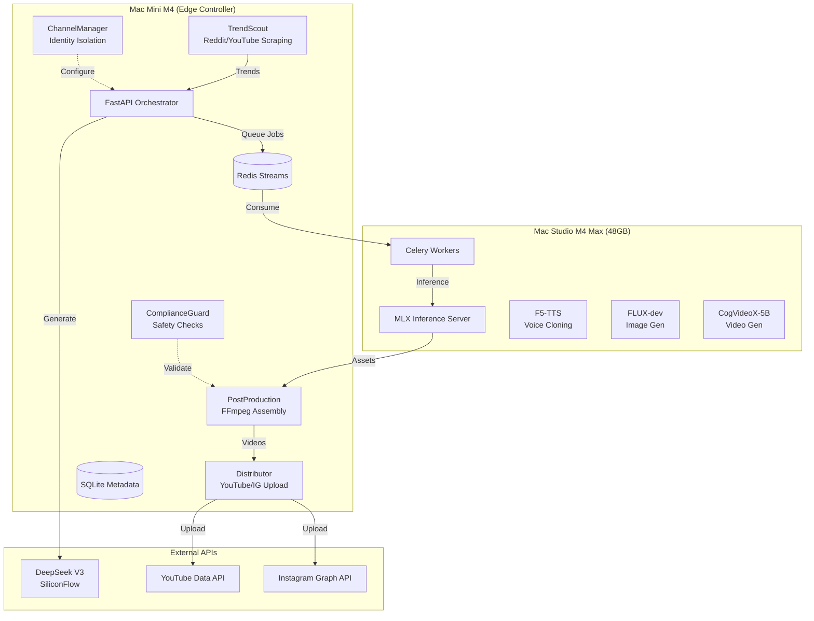

# SiliconCurtain 🤖🎬

> Production-grade AI content automation pipeline leveraging Hong Kong infrastructure for cost-effective, multi-tenant video production at scale.

[](https://www.python.org/downloads/)
[](https://fastapi.tiangolo.com/)
[](https://opensource.org/licenses/MIT)

## 🎯 Mission

SiliconCurtain arbitrages Chinese AI costs (DeepSeek API, local MLX inference) against Western platform revenue (YouTube/Instagram), targeting:

- **50+ videos/day** across **12+ channels**
- **Zero API costs** for inference (local MLX models)
- **< $0.10 USD** cost per video (electricity + API only)
- **100% automated** pipeline with anti-detection compliance

## 🏗️ Architecture



## 📁 Repository Structure

```
siliconcurtain/
├── src/
│   ├── api/                    # FastAPI orchestration service
│   │   ├── main.py            # Application factory
│   │   └── routers/           # API endpoints
│   │       ├── health.py
│   │       ├── trends.py
│   │       ├── scripts.py
│   │       └── channels.py
│   ├── trendscout/            # Intelligence gathering
│   │   ├── scrapers.py        # Reddit/YouTube/Google Trends
│   │   ├── analyzer.py        # DeepSeek virality scoring
│   │   └── scheduler.py       # APScheduler integration
│   ├── scriptforge/           # Content generation
│   │   ├── prompts.py         # Jinja2 template manager
│   │   └── generator.py       # LLM client with fallback
│   ├── assetfactory/          # Local AI inference (Studio)
│   ├── postproduction/        # FFmpeg assembly (Mini)
│   ├── channelmanager/        # Multi-tenant isolation
│   ├── distributor/           # Social media uploaders
│   ├── complianceguard/       # Safety & policy checks
│   └── shared/                # Common utilities
│       ├── config.py          # Pydantic settings
│       ├── database.py        # SQLAlchemy async
│       ├── models.py          # Pydantic models
│       ├── orm_models.py      # SQLAlchemy models
│       ├── logger.py          # Structured logging
│       ├── circuit_breaker.py # Resilience pattern
│       └── redis_client.py    # Async Redis
├── tests/
│   ├── unit/                  # Unit tests (90%+ coverage)
│   ├── integration/           # Integration tests
│   └── e2e/                   # End-to-end tests
├── config/
│   ├── prompts/               # Jinja2 prompt templates
│   └── channels/              # Channel persona configs
├── migrations/                # Alembic migrations
├── deployments/
│   ├── mini/                  # Docker, systemd for Mini
│   └── studio/                # systemd for Studio
├── docker-compose.yml         # Mini services orchestration
├── Makefile                   # Development commands
├── pyproject.toml            # Python dependencies
└── README.md                 # This file
```

## 🚀 Quick Start

### Prerequisites

- Python 3.12+
- Redis 7+
- FFmpeg (with VideoToolbox on macOS)
- Docker & Docker Compose (for deployment)

### Installation

```bash
# Clone repository
git clone https://github.com/yourusername/siliconcurtain.git
cd siliconcurtain

# Install dependencies
make install

# Setup environment
cp .env.example .env
# Edit .env with your API keys

# Initialize database
make db-init

# Run migrations
make migrate
```

### Development

```bash
# Start Redis
docker run -d -p 6379:6379 redis:7-alpine

# Run in development mode
make dev

# Run tests
make test
make test-cov

# Run linters
make lint
make format
```

### Docker Deployment (Mac Mini)

```bash
# Build and start all services
docker-compose up -d

# View logs
docker-compose logs -f

# Stop services
docker-compose down
```

### Mac Studio Workers

```bash
# Copy deployment files
scp -r deployments/studio/ studio.local:~/siliconcurtain/

# Install systemd service
ssh studio.local "cd ~/siliconcurtain && ./install_service.sh"

# Check status
ssh studio.local "sudo systemctl status siliconcurtain-worker"
```

## 📊 Data Models

### Content Calendar

| Field | Type | Description |
|-------|------|-------------|
| `id` | UUID | Primary key |
| `channel_id` | FK | Channel reference |
| `source_trend_id` | FK | Source trend reference |
| `script_json` | JSON | Video script data |
| `status` | Enum | drafted → assets_ready → rendering → uploaded → published |
| `scheduled_publish_at` | datetime | Publication time |
| `youtube_video_id` | string | Platform video ID |

### Channel Personas

| Field | Type | Description |
|-------|------|-------------|
| `id` | PK | UUID |
| `niche_category` | Enum | finance, technology, relationships, etc. |
| `voice_config` | JSON | TTS model, pitch, speed |
| `visual_config` | JSON | LoRA path, color palette, fonts |
| `posting_window` | JSON | Timezone, hours, best days |

## 🔧 Configuration

### Environment Variables

```bash
# Core
ENVIRONMENT=production
DEBUG=false
SECRET_KEY=your-secret-key

# Database
DATABASE_URL=sqlite+aiosqlite:///data/siliconcurtain.db

# Redis
REDIS_URL=redis://localhost:6379/0

# DeepSeek API (SiliconFlow)
DEEPSEEK_API_KEY=sk-...
DEEPSEEK_BASE_URL=https://api.siliconflow.cn/v1

# Local LLM
OLLAMA_BASE_URL=http://studio.local:11434

# Reddit API
REDDIT_CLIENT_ID=...
REDDIT_CLIENT_SECRET=...

# YouTube API
YOUTUBE_API_KEY=...
YOUTUBE_CLIENT_ID=...
YOUTUBE_CLIENT_SECRET=...
```

### Channel Configuration

See `config/channels/` for example configurations. Each channel defines:

- **Persona**: Voice, visual style, tone
- **Posting Schedule**: Timezone, optimal hours
- **Content Preferences**: Duration, format, music
- **SEO Settings**: Keywords, tags, categories

## 🧪 Testing

```bash
# Run all tests
make test-all

# Run specific test types
make test        # Unit tests
make test-int    # Integration tests
make test-e2e    # End-to-end tests

# Coverage report
make test-cov
```

Test coverage targets:
- **Unit tests**: 90%+ coverage
- **Integration tests**: Database, Redis, API
- **E2E tests**: Full pipeline end-to-end

## 📈 Monitoring

Health endpoints:

```bash
# Health check
curl http://localhost:8000/health

# Readiness probe (K8s)
curl http://localhost:8000/ready

# Liveness probe (K8s)
curl http://localhost:8000/live
```

Metrics available via Prometheus (Phase 4).

## 🔒 Security

- No hardcoded credentials (1Password CLI integration)
- Circuit breakers prevent API hanging
- Rate limiting per source (60 req/min)
- Channel isolation via Docker containers
- Content safety checks (Baidu TextCensor)
- PII redaction in logs

## 📋 Phase Roadmap

| Phase | Deliverables | Timeline |
|-------|-------------|----------|
| **1: Foundation** | Docker Compose, TrendScout, DeepSeek client, DB schema, tests | Week 1 |
| **2: Asset Pipeline** | Celery workers, MLX server, F5-TTS, FLUX, FFmpeg | Week 2 |
| **3: Distribution** | YouTube OAuth, ChannelManager, upload queue, ComplianceGuard | Week 3 |
| **4: Scale** | Prometheus metrics, multi-channel support, disaster recovery | Week 4 |

## 🤝 Contributing

1. Fork the repository
2. Create a feature branch (`git checkout -b feature/amazing-feature`)
3. Run tests (`make test`)
4. Commit changes (`git commit -m 'Add amazing feature'`)
5. Push to branch (`git push origin feature/amazing-feature`)
6. Open a Pull Request

## 📄 License

MIT License - see [LICENSE](LICENSE) file.

## ⚠️ Disclaimer

This project is for educational purposes. Users are responsible for:
- Compliance with platform Terms of Service
- Copyright and fair use compliance
- Content authenticity and disclosure requirements
- Local laws and regulations (including HK NSL)

## 🙏 Acknowledgments

- [DeepSeek](https://deepseek.ai/) for affordable API access
- [SiliconFlow](https://siliconflow.cn/) for HK infrastructure
- [MLX](https://github.com/ml-explore/mlx) for local inference
- [FastAPI](https://fastapi.tiangolo.com/) for the web framework
